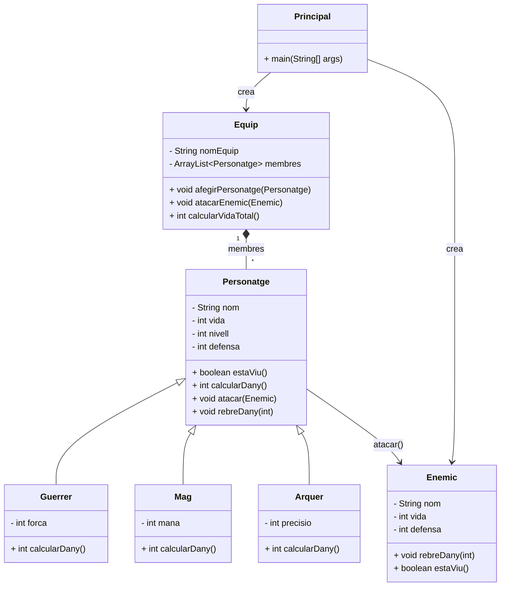

# Sistema de Personatges (RPG)

Activitat pràctica guiada per treballar herència, polimorfisme i disseny orientat a objectes en Java.

## Contextualització

En aquesta activitat desenvolupareu una part del motor d’un petit videojoc de rol. En aquest joc hi ha diferents tipus de personatges que formen un equip d’aventurers i que poden atacar un enemic comú.

Tots els personatges han de tenir **nom**, **vida** i **nivell**, i tots poden **atacar**. Tot i això, cadascun calcula el dany d’una manera diferent segons el seu rol: el Guerrer amb la **forca**, el Mag amb la **mana** i l’Arquer amb la **precisio**.

Aquesta situació us ha de permetre decidir quina informació és comuna i quina és específica, i també quins mètodes convé posar a la superclasse i quins convé redefinir a les subclasses. Per evitar repetir codi i poder ampliar fàcilment el sistema en el futur, dissenyareu una **jerarquia de classes utilitzant herència**.

## Objectius d’aprenentatge

### Modelatge del domini
Identificar atributs comuns i específics, i convertir-los en una jerarquia de classes coherent.

### Herència en Java
Aplicar `extends`, reutilitzar constructors amb `super(...)` i definir subclasses especialitzades.

### Polimorfisme
Redefinir comportaments amb `@Override` perquè cada tipus de personatge tingui una lògica pròpia.

### Col·leccions i composició
Gestionar un equip amb `ArrayList<Personatge>` i entendre com una classe en conté d’altres.

---

## FASE 1 · Anàlisi del problema

Abans d’escriure codi, identifica què comparteixen tots els personatges i què diferencia cada subclasse.

En el joc hi ha tres tipus de personatges: **Guerrer**, **Mag** i **Arquer**.

- **Comú a tots:** nom, punts de vida, nivell.
- **Atribut específic:** Guerrer → `forca` | Mag → `mana` | Arquer → `precisio`.

### Tasques d’anàlisi (respon abans de programar)

1. Quins atributs són comuns a tots els personatges?
2. Quins atributs són específics de cada tipus?
3. Quina hauria de ser la superclasse? Quines subclasses crearies?
4. Quin mètode hauria de redefinir cada subclasse?

## FASE 2 · Implementació de la superclasse `Personatge`

Comença per la classe base i deixa-hi encapsulat el comportament comú de tots els personatges.

Implementa la classe `Personatge`. Aquesta serà la base del sistema.

- **Atributs:** `nom`, `vida`, `nivell`
- **Mètodes obligatoris:** constructor amb tots els atributs, getters i setters.
- **Comportaments:**
  - `boolean estaViu()`
  - `void mostrarInformacio()`
  - `int calcularDany()` *(retornarà inicialment el valor del nivell)*
  - `boolean rebreDany(int dany)` *(retornarà cert si ha mort en rebre l'atac)*
  - `void atacar(Personatge enemic)` *(ha de calcular el dany, aplicar-lo a l’enemic i mostrar un missatge)*

## FASE 3, 4 i 5 · Implementació de les subclasses

Ara especialitza el comportament heretat redefinint els mètodes necessaris a cada subclasse.

### 🗡️ Fase 3: Guerrer

Crea la classe `Guerrer extends Personatge`.

- **Atribut nou:** `forca`
- **Constructor:** ha d'usar `super(...)`
- **Sobreescriptura:** redefineix amb `@Override` els mètodes `mostrarInformacio()` i `calcularDany()`. El dany serà: `forca + nivell`.

### 🔮 Fase 4: Mag

Crea la classe `Mag extends Personatge`.

- **Atribut nou:** `mana`
- **Sobreescriptura:** redefineix els mètodes necessaris amb `@Override`. El dany serà: `(mana / 2) + nivell`.

### 🏹 Fase 5: Arquer

Crea la classe `Arquer extends Personatge`.

- **Atribut nou:** `precisio`
- **Sobreescriptura:** redefineix els mètodes necessaris amb `@Override`. El dany serà: `precisio + (nivell / 2)`.

> **Ampliació opcional:** si voleu més dinamisme, podeu aplicar un petit factor aleatori al dany final (p. ex. entre `0.9` i `1.1`) abans de retornar-lo.

## FASE 6 · Implementació de la classe `Equip`

Aquesta classe actuarà com a contenidor d’objectes i et permetrà practicar polimorfisme.

- **Atributs:** `nomEquip`, `ArrayList<Personatge> membres`
- **Recomanació:** inicialitza la llista `membres` dins del constructor.
- **Mètodes:**
  - `void afegirPersonatge(Personatge p)`
  - `void mostrarEquip()`
  - `int calcularVidaTotal()`
  - `void atacarEnemic(Enemic e)` *(tots els personatges vius ataquen l'enemic iterant la llista)*

## FASE 7 · Programa principal

En aquesta fase uniràs totes les peces i comprovaràs per consola que el comportament és el que esperes.

Crea una classe `Principal` per testejar el sistema:

1. Crea un Guerrer, un Mag i un Arquer.
2. Crea un Equip i afegeix-hi els personatges.
3. Crea un Enemic i mostra el seu estat inicial.
4. Fes que l'equip ataqui l'enemic.
5. Mostra l'estat final de l'enemic.

### Exemple de sortida esperada

```text
L'equip Herois ataca el drac...

Thorin (Guerrer) causa 35 punts de dany
Merlina (Mag) causa 28 punts de dany
Lira (Arquer) causa 22 punts de dany

Vida restant del drac: 115
```

## FASE 8 · Preguntes de reflexió

Quan el programa funcioni, respon aquestes preguntes per justificar les decisions de disseny que has pres.

1. Per què la classe Equip utilitza `ArrayList<Personatge>` en lloc de llistes separades per a cada tipus?
2. Quin avantatge pràctic té redefinir el mètode `calcularDany()` a les subclasses?
3. Què passaria si afegíssim una classe nova anomenada `Sanador`? Caldria modificar la classe `Equip`? Per què?

---

## EXTRA · 🏆 Reptes i ampliacions

Si voleu anar més enllà, aquí teniu extensions per convertir el projecte en un sistema de combat més complet.

- **Dany total de l’equip:** implementa `int calcularDanyTotalEquip()` a la classe `Equip` per estimar el dany potencial abans de l’atac real.
- **Personatges debilitats:** evita que un personatge amb la vida a 0 pugui atacar i mostra un missatge com *"Thorin està debilitat i no pot atacar!"*.
- **Múltiples enemics:** crea una col·lecció d’enemics i reparteix els atacs entre diferents objectius.
- **Combat entre equips:** fes que dos equips s’enfrontin i compara qui continua viu després de cada ronda.
- **Combat per torns:** afegeix una estructura de rondes on cada personatge i enemic actua segons un ordre determinat.
- **Factor aleatori de dany:** aplica un modificador aleatori (per exemple entre 0.8 i 1.2) al dany final de cada atac.
- **Pífia en atac:** si el valor aleatori surt molt baix, l’atac falla i el personatge es fa una petita quantitat de dany a si mateix.
- **Sistema de defensa:** afegeix l’atribut `defensa` a personatges/enemics i redueix el dany rebut en funció d’aquest valor.

### 💡 Pistes per a les ampliacions

- Per a múltiples enemics, prova amb `ArrayList<Enemic>` i un mètode que retorni el primer enemic viu.
- Per al combat entre equips, et poden anar bé mètodes com `teMembresVius()` i `obtenirSeguentCombatent()`.
- Per al combat per torns, comença amb un bucle `while` que representi rondes i mostra el número de torn per consola.
- Per al factor aleatori, encapsula la lògica en un mètode com `aplicarVariacioAleatoria(int danyBase)`.
- Per a la pífia, defineix un llindar (p. ex. tirada < 0.1) i aplica `rebreDany(...)` al mateix atacant.
- Per a la defensa, pots calcular `danyFinal = Math.max(0, dany - defensa)` per evitar valors negatius.
- Si vols escalar el disseny, separa la lògica en una nova classe com `Combat` o `GestorCombat`.

---

## UML del projecte (Mermaid)


